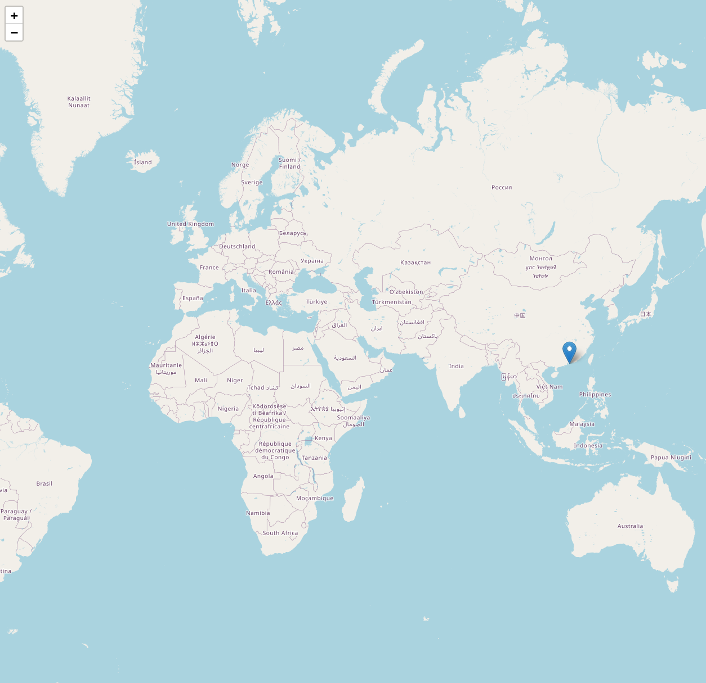

# IP Geolocation

Se trata de un script que ofrece la posibilidad de dar una localización apróximada de una dirección IPv4 otorgada por el usuario, no necesariamente apunte al router sino que puede corresponder a un nodo o centro de operaciones del proveedor de internet (ISP).


## Instalación

Para poder ejecutar correctamente el script se requiere instalar algunos paquetes externos de Python, todas las referencias se ubican en el archivo **requirements.txt**.

Instalar Python en caso de que no lo tenga:

[Download Python](https://www.python.org/downloads/)

Instalación de paquetes externos:

```bash
  pip install ipinfo folium dotenv
```


## Funcionalidades

- **Información acerca de la IP**: Tras ejecutar el script e introducir una dirección IP, nos otorga información relevante como el nombre del host, el país o la región donde se localiza, así como la organización asociada entre otras. La información otorga es debido al uso del paquete externo **ipinfo**

- **Uso de folium**: Gracias al uso del paquete externo folium el script es capaz de generar un mapamundi donde marca de forma clara donde se ubica de manera aproximada la dirección IP otorgada.

- **Almacenamiento del mapa**: El mapa generado por folium por defecto se almacena en el misma ruta donde resida el script. Se almacena en formato HTML, por lo que solo basta abrirlo a través del navegador web para poder visualizarlo.


## Ejemplo de uso

A continuación se muestra un ejemplo de como se ve el script al ejecutarlo, toda la información relevante ha sido borrada, es más para mostrar como se vería por pantalla la info tras lanzar el script.

```bash
$ python ip_geolocation.py        

Dime una dirección IPv4: IP
ip : IP
hostname : HOSTNAME
city : CITY
region : REGION
country : COUNTRY
loc : LOC
org : ORG
postal : POSTAL
timezone : TIMEZONE
readme : https://ipinfo.io/missingauth
anycast : True
country_name : COUNTRY_NAME
isEU : False/True
country_flag_url : https://cdn.ipinfo.io/static/images/countries-flags/COUNTRY.svg
country_flag : {'emoji': 'COUNTRY', 'unicode': 'UNICODE'}
country_currency : {'code': 'CODE', 'symbol': '$'}
continent : {'code': 'CODE', 'name': 'NAME'}
latitude : LATITUDE
longitude : LONGITUDE
Mapa guardado en: RUTA_MAPA
```


## Screenshots

Así se vería el mapa si por ejemplo abrimos en el navegador el fichero .html obtenido tras lanzar el script.




## Desarrollo

El script presentado se encuentra desarrollado en **Python**.


## Disclaimer

El script fue creado únicamente por motivos educativos, principalmente para aprender a realizar scripts o programas desarrollados en Python que involucren conceptos o casos prácticos a la Ciberseguridad o al Hacking Ético.

Se ruega utilizar los programas añadidos a este repositorios para dicho fin sobre equipos aislados o virtuales para simular el entorno, en caso contrario, no nos hacemos responsables de su uso fuera de ese ámbito.

